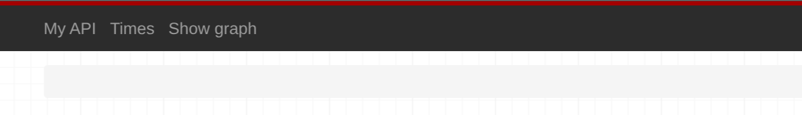
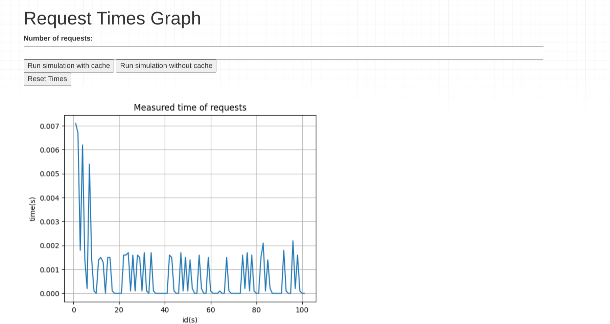

# API example with caching performance measurement
This is my project to learn and implement caching, create simulation for responses to our RestAPI and then measure performance between requests with/without cache. I used this project to further expand my knowledge related to API's and caching.

## How It's Made:

**Tech used:** Python, HTML, DjangoREST framework

For this project I decided to use DjangoREST framework as it provide lot of functionality out of the box.
I have edited the template provided by framework to display our time measurements in a graph. The values measured during requests are stored in DB (I used default MySQL) and then graph is generated from those values. To generate graph I used matplotlib library and data are temporary stored in a stream. To simulate requests I decided to create simple function 'getting_request' where both request and caching logic is implemented (based on the client choice).
Requirements to run the API can be found in requirements.txt

## How It Works:

First we need to feed our DB:

Run migrations to create our models.

Then run script: 
`python manage.py runscript db_feed`

This will feed our DB with books, more precisely books from table that can be found here:

[Book Table URL](https://en.wikipedia.org/wiki/List_of_best-selling_books)

You can feed DB with your own data if you want but you need to modify simple web scraper that can be found `/scripts/db_feed.py`

We need to set our URL for simulation -> `/scripts/simulation.py` usually localhost so we will have valid URL + endpoints.

We can start our server and we can navigate through Navbar to view our requests/performance graph and run simulations from our client.

We can choose number of requests and run simulation with or without cache.

## Lessons Learned:

It was fun project to work with RestAPI to learn how to implement cache logic - here I haven't used built-in cache per site or cacheView but created logic inside function to be able to cache based on client request. 

